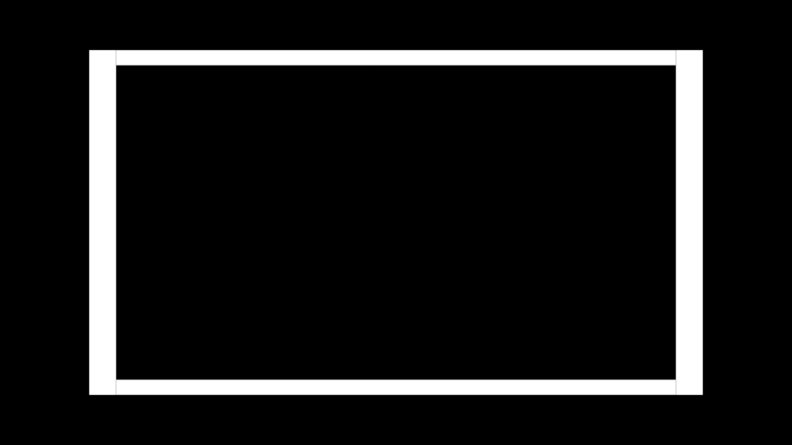

# ADL Test Pattern Generator
This is a shader that creates an ADL test pattern for arbitrary ADL (Average Display Luminance). It creates a square which grows to the outer region with increasing ADL. That means that the sensor that measures the black level in the mittel of the screen always has the same distance to the inner borders of the square.

Examples:

1 % ADL:

10 % ADL:

